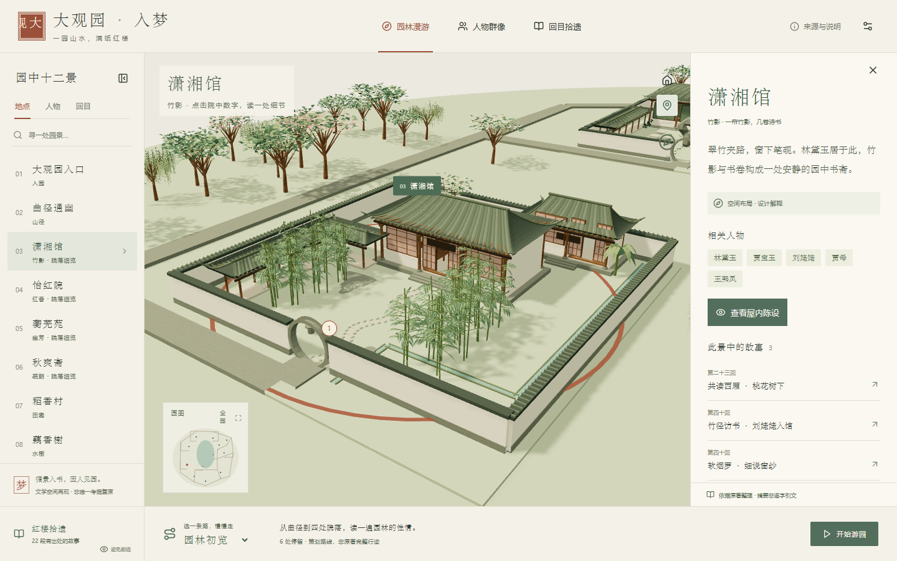

# 大观园 · 入梦

在可旋转、缩放的三维园林中，沿地点、人物和回目阅读《红楼梦》。浏览无需账号或 API Key。

在线游园：[大观园 · 入梦](https://daguanyuan-rumeng.zeabur.app/) · Zeabur / Aliyun California 4C 8GB。此次原著建模、手机优化和验证说明见 [docs/REFINEMENT.md](docs/REFINEMENT.md)。



## 启动

在本目录打开终端：

```powershell
npm ci
npm run dev
```

打开终端显示的本地地址，通常为 http://127.0.0.1:5173。已附带模型，无须先安装 Blender 或重新建模。

```powershell
npm run build
npm run preview -- --port 4173
```

`dist/` 是静态构建。须通过 HTTP 服务器打开，不能双击 HTML 使用 file 协议。`npm start` 使用本项目 Node 静态服务器，默认端口3000；`npm run deploy:package` 生成仅含公开文件的 `.deploy/` Docker 发布包。已部署到用户现有加利福尼亚服务器，重部署步骤见 [docs/DEPLOYMENT.md](docs/DEPLOYMENT.md)。

## 游园

- 拖动旋转、滚轮缩放、右键平移；手机双指缩放与平移。
- 点击园景、地点列表或小地图，三者使用同一个地点 ID。
- 重点院落可点击“查看屋内陈设”，临时移开屋面观察书案、隔间等细节，再点击“返回院落全貌”。“原著中的形与景”列出相应文本依据。
- 人物与回目会突出关联园景；点击情节，查看摘要、参与人物及可展开的原文依据。
- 底部选择“园林初览”“诗社与雅集”或“刘姥姥游园”；支持播放、暂停、继续、前后站与退出。拖动视角会暂停导览。
- 每站停靠约5秒并打开该景资料；行进时收起。需要慢读时点击暂停。
- 设置提供轻量画质、地点名签、动态效果及防剧透。默认没有环境声音。
- Esc 关闭面板并退出导览；无 WebGL 的设备仍可阅读索引与来源。

## 交付结构

| 路径 | 内容 |
|---|---|
| `blender/daguanyuan_master.blend` | 全园可编辑主场景，含12地点、材质、打包图片和渲染相机 |
| `blender/xiaoxiangguan_sample.blend` | 潇湘馆纵向样板 |
| `public/models/overview.glb` | 按地点组织的总览 |
| `public/models/overview-low.glb` | 约0.59 MiB，按地点合批的顶点色轻量总览，保留热点元数据 |
| `public/models/places/*.glb` | 12个按需分区；加载精细院落时隐藏对应总览节点 |
| `public/models/places-low/*.glb` | 12个手机分区；触摸设备默认使用轻量模式 |
| `public/draco/` | 本地 Draco 解码器及许可；26个模型均含几何压缩 |
| `blender/refined_modules.py` | 曲屋面、瓦垄、木构、花格、精细植被与各院独立陈设 |
| `config/architecture.json` | 11项经原文核查的建筑、植被及陈设依据 |
| `config/garden.layout.json` | 唯一布局、道路图和镜头偏移源，Blender Z-up |
| `public/scene-manifest.json` | 转为网页Y-up的位置、热点、相机与道路图 |
| `data/canon/` | 12地点、13人物、22事件、3策划导览及来源 |
| `data/raw/` | 固定获取版本的原文缓存，仅供整理，不发布 |
| `assets/manifest.json` | 外部资源许可、作者、来源、哈希和衍生记录 |
| `reports/browser/` | 实际浏览器截图与端到端报告 |
| `reports/acceptance/` | 数据、模型、测试和性能记录 |

## 重建模型和数据

运行环境实测：Windows 11、Node 24.12.0、npm 11.6.2、Blender 4.5.9 LTS。Blender通过官方ZIP与SHA256校验获取，便携目录不属于静态发布包。

Windows：

```powershell
# 如果不使用项目已有便携版，可指定自己的 Blender
$env:BLENDER_BIN = 'C:\Program Files\Blender Foundation\Blender 4.5\blender.exe'
python scripts/make_layout.py
npm run assets:fetch
python scripts/fetch_content.py
npm run content:prepare
npm run models:build
npm run models:optimize
npm run data:build
npm run build
```

macOS/Linux：先安装 Blender、Python 3 与 requests、beautifulsoup4、Pillow，再使用同名 npm 命令；必要时设置：

```bash
export BLENDER_BIN=/Applications/Blender.app/Contents/MacOS/Blender
# Linux 可使用 export BLENDER_BIN=/usr/bin/blender
python3 scripts/make_layout.py
npm run models:build
```

跨系统执行资产/内容命令时，若只有 `python3` 而无 `python`，使用 `python3 scripts/fetch_assets.py`、`python3 scripts/prepare_content.py` 和 `python3 scripts/prepare_architecture.py`。源码中无本机绝对路径。

Blender重建只替换生成集合，保留 `Manual_Adjustments` 集合。希望保留的手工微调请放入该集合；生成院落本身的修改需要回写构件脚本。母场景保存先于Web临时LOD处理，源模型保持精细。导出脚本使用参数数组处理含空格路径，关闭外部嵌入脚本自动运行。

需要重建母场景中的渲染相机、水面与环境光，并输出两个 Blender 视角时，在 `models:build` 后执行：

```powershell
& '.tools/blender-4.5.9-windows-x64/blender.exe' --background --disable-autoexec --python-exit-code 1 --python blender/render_views.py
```

使用自己的 Blender 时替换可执行文件路径。渲染脚本会保存到母场景，打包外部图片并改为相对路径。

```powershell
npm run doctor
npm run typecheck
npm run lint
npm run test
npm run verify
npm run test:e2e
```

Playwright默认使用本机Edge；其他系统可将 `playwright.config.ts` 的 `channel` 改为已安装Chrome，或安装Playwright Chromium后移除channel。端到端测试在 `.test-dist/` 单独构建，调试钩子不会进入正式 `dist/`。

## 内容与边界

所选数字文本为维基文库《紅樓夢》分回页面，记录修订号、日期与双哈希。执行代理已逐条查阅，未声称红学专家审核。“展示位置”与“原著地点”分开；共读西厢原在沁芳闸桥边，借潇湘馆展示。

这是文学空间的美术再现，尺寸与方位不是考据测绘。导览路径是策划线路，不等同于原著人物的完整真实行迹。未接入OpenStory或AI智能体，不展示虚假实时在场信息。

更多说明见 `docs/ARCHITECTURE.md`、`docs/CONTENT_POLICY.md`、`docs/KNOWN_ISSUES.md` 与 `THIRD_PARTY_NOTICES.md`。

验收入口：`docs/PROGRESS.md`、`docs/PERFORMANCE.md`、`docs/ENVIRONMENT.md`，以及 `reports/browser/playwright-report/index.html`。视觉规范保存在 `DESIGN.md` 和 `.impeccable/design.json`。
