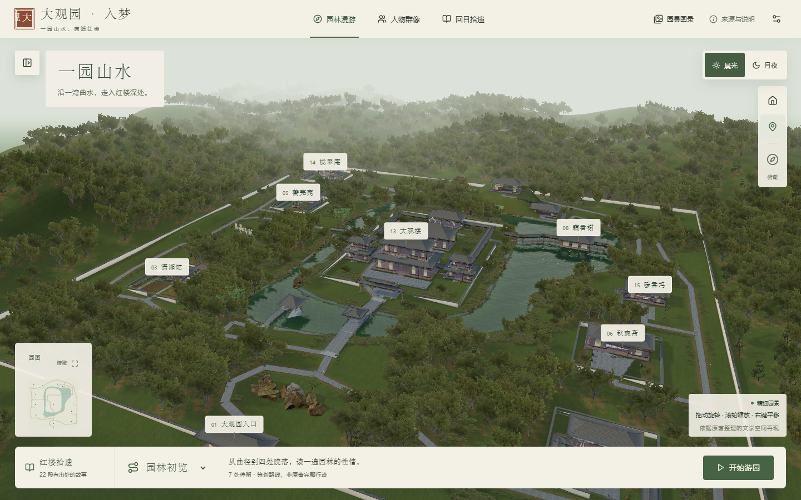

# 大观园 · 入梦

以《红楼梦》原文和十五幅园景参考图为依据的可交互三维园林。点击景点，旋转近看院落、进入屋内、查看结构剖视，并展开原文出处与参考图。

[在线游园](https://daguanyuan-rumeng.zeabur.app/) · 用户既有 Zeabur 加利福尼亚服务。最新部署是否验证通过，以 `reports/acceptance/zeabur-deployment.json` 的时间及 `health.revision` 为准。



## 本轮重建

15 处景点使用一份连续的地形、水岸、道路和位置配置。本轮按用户《图文索引.html》P01/P02 成对总平面与鸟瞰重构中央省亲组群、绕水及两侧院落；核对门后翠嶂、沁芳桥亭、藕香榭跨水接岸和凸碧—凹晶的高低邻接。模型、水面、园图和导览共享几何配置，新增独立俯瞰操作。详见 [空间重构依据](docs/SPATIAL_RECONSTRUCTION.md)。

视觉层重建连续坡地、厚石岸、混合林冠、木构接合及书案陈设；远景树采用源模型的四向／俯视烘焙，近树按视距使用三维网格。图录保留全部 15 幅美术参考，可直接跳转到对应三维景点。

实时模型尚未达到参考图的照片级效果。布局、背面结构、尺度及色彩是美术解释；书中明确的景物与陈设另列原文证据。当前不是参考图逐像素复刻，也不是历史建筑测绘复原。

## 启动与构建

大型 Blender 场景、源资产及历史文件通过 Git LFS 保存。首次克隆仓库后，先运行 `git lfs install` 和 `git lfs pull`，取得完整文件。

**macOS / Windows 换机与多人协作请从 [迁移与协作说明](docs/MIGRATION.md) 开始。** 全部现用建模素材随仓库提供；工具安装包、可选历史素材的下载入口及校验信息也在仓库内。

```powershell
npm ci
npm run dev
```

浏览器打开终端地址。已附带模型，普通启动无需 Blender。正式构建使用 `npm run build`，`npm start` 从 `dist/` 提供 HTTP 服务；不能用 file 协议双击 HTML。

需要运行素材处理、建模或打包脚本时，先安装完整 Python 依赖：

```powershell
python -m pip install -r requirements-dev.txt
npm run materials:check
npm run models:portability
```

以下是主动重建流程，会重新生成对应文件；接续已有模型时，从已提交的母场景开始编辑即可。原有 `assets:fetch` 会重新整理来源清单，首次克隆不需要运行它。

```powershell
npm run content:prepare
npm run textures:bake
npm run models:build
npm run models:verify
npm run models:optimize
npm run spatial:check
npm run build
```

完整资产重建需要 Node、Python（requests、beautifulsoup4、Pillow、numpy）与 Blender。Windows 已验证 Blender 4.5.9 LTS；可用 `BLENDER_BIN` 指定另一安装路径。模型优化通过独立进程完成解码和验证，再原子替换，避免 Windows 映射文件锁。

## 游园操作

- 拖动旋转，滚轮缩放，右键平移；手机支持触摸旋转及双指操作。
- 点击画布名签、索引或小地图进入景点；“俯瞰”查看统一布局，“院落全貌”“屋内陈设”“剖视结构”分别控制对应视角。露天景点不显示不存在的屋内视角。
- 晨光／月夜切换照明；园景图录支持放大、左右切换和进入三维景点，载入失败可重试。
- 人物、回目及事件联动原文来源；设置中提供防剧透与阅读进度。
- 三条导览沿道路图行进，每站停留约 5 秒；可暂停、继续、前后站或退出。它们是策划路线，并非原著完整人物行迹。
- 手机默认轻量模型、DPR 1、低分辨率反射及按需渲染；选择地点后加载独立手机分区。

## 交付文件

| 路径 | 内容 |
|---|---|
| `blender/daguanyuan_master.blend` | 15 景点可编辑母场景，保留 Manual_Adjustments |
| `config/garden.layout.json` | 统一位置、道路、湖岸与镜头配置 |
| `blender/reference_scene.py` | 母场景生成入口 |
| `blender/reference_world.py` / `reference_craft.py` | 地形、园林、屋面和陈设构件 |
| `blender/spatial_world.py` / `interior_craft.py` | 本轮连续地形、接岸桥廊、省亲组群与室内细节 |
| `public/models/` | 当前总览、地点分区、植被原型与全部配套 GLB；数量由迁移检查实际统计 |
| `assets/source/` / `assets/processed/` | 原始模型、PBR 贴图、HDRI、植被与处理后的建模素材 |
| `assets/textures/shared/` | 归档 GLB 使用的共享贴图，来源记录在 archive-provenance.json |
| `public/textures/shared/` | 按内容哈希共享的本地材质贴图 |
| `public/art/` | 15 幅大图与 15 幅缩略图，WebP 及生成提示词记录 |
| `output/imagegen/daguanyuan-reference-20260910/` | 原始 PNG、图录、提示词和来源说明 |
| `data/canon/` | 15 地点、13 人物、22 事件、46 来源、3 导览 |
| `assets/manifest.json` | 外部资源许可、来源、原文件和衍生哈希 |
| `reports/acceptance/` | 数据、模型、浏览器、性能及部署检查记录 |

重建仅替换生成集合，手动改动应保存在 `Manual_Adjustments`。当前母场景和 `reports/checkpoints/r13-before/`、`reports/checkpoints/r14-before/` 已在 GitHub / LFS。旧机器 `.checkpoints/` 中更早的临时备份不属于当前开发依赖；迁移检查和现用素材无需读取它。历史潇湘馆样板也已保留。

运行 `npm run typecheck`、`npm run lint`、`npm test`、`npm run verify`、`npm run test:e2e` 检查代码与交互；`npm run models:verify` 还会重开母场景并沿道路对实际地形做三维射线采样。性能方法和局限见 [PERFORMANCE](docs/PERFORMANCE.md)，部署见 [DEPLOYMENT](docs/DEPLOYMENT.md)，视觉边界见 [KNOWN_ISSUES](docs/KNOWN_ISSUES.md)。
