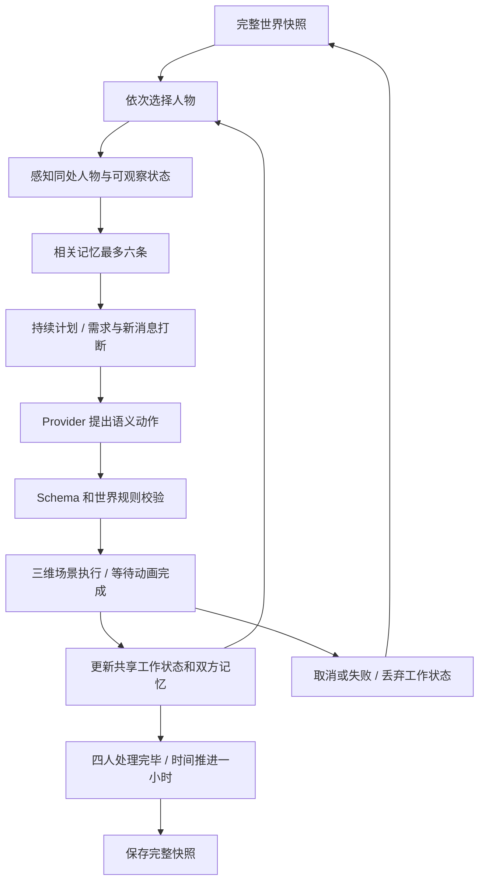

# 大观园世界推演 / IF 反事实模拟

本模块在既有 React、TypeScript、R3F / Three.js、Zustand 项目中运行。人物、地点身份来自已核对的 `data/canon`；人格参数、初始时间、数值、动作和对白均为明确标注的虚构推演，不写回原文资料。

## 使用

1. `npm ci`，然后 `npm run dev`。打开页面，待三维园林载入后选择“世界推演”。
2. 默认“本地规则”不需要 API Key。先点“竹下问安”交谈、“邀一席茶”发出邀请，或点“继续故事”观察下一步；也可输入假设并点击“创建 IF 世界”。
3. 示例：**如果宝玉提前知道贾府准备让他迎娶薛宝钗，会发生什么？**
4. 创建分支只给宝玉添加知情记忆，时间和位置不变。第一次运行时宝玉沿现有园路来到潇湘馆；相遇后可问安。下一步宝玉会将知情消息告诉黛玉，对话和获知消息分别进入双方记忆。宝钗和王熙凤不会自动知道这件事。
5. “人物心迹”查看位置、情绪、计划、关系和最近记忆，并跟随人物。可在场景中点选人物、托付行动或追问其打算与所知。“全园观察”取消跟随；手动拖动镜头也会暂时停止跟随。
6. “时间快照”恢复任一保留时刻。主世界、当前 IF 和最多三条历史 IF 分别保存最近30个完整快照；从旧时刻继续会改写该分支后续记录。创建新 IF 自动保留旧 IF；“世界线”可以恢复并交换两条线，容量满时不会静默覆盖。
7. 自动运行逐步串行执行；暂停会冻结当前场景动作。撤销本步、退出推演、模型失败或图形上下文失效会恢复最后一个完整快照。
8. 完整快照保存在当前浏览器的 localStorage，刷新后仍在。可导出全部世界的 JSON 存档，也可导出带事件依据的 Markdown 推演纪要。不同设备、浏览器或域名之间不自动同步；目前不提供 JSON 导入。

无 WebGL 的设备可阅读人物和存档，不能将文字结果冒充已完成的三维推演。上下文失效时显示重载入口，以轻量画质重试。

## 架构与文件

| 文件 | 职责 |
| --- | --- |
| `src/simulation/types.ts` | Zod Action、Agent、Intervention、World、Snapshot、Journal Schema；Provider 接口 |
| `src/simulation/world.ts` | 初始状态、记忆上限、IF 分支、快照恢复、存档验证 |
| `src/simulation/planning.ts` | 持续计划、托付与新消息打断、身体与情绪需要、分时日程 |
| `src/simulation/space.ts` | 现有模型中的四院站位与分段通路 |
| `src/simulation/insights.ts` | 消息流转、同 Tick 对照、个人追问与有事件依据的报告 |
| `src/simulation/perception.ts` | 个人视野、相关记忆、可说的话 |
| `src/simulation/rules.ts` | 语义校验、距离和存活检查、语义动作到路网的映射 |
| `src/simulation/providers.ts` | 无密钥规则决策与同源 HTTP Provider |
| `src/simulation/engine.ts` | 串行、可取消、整步提交的 Tick 执行器 |
| `src/simulation/store.ts` | UI 状态、执行桥接、互斥控制、持久化 |
| `src/scene/SimulationActors.tsx` | 分段行走、转身、人物标签、临场镜头与自动跟拍 |
| `src/scene/GardenCharacter.tsx` | 本地 GLB 关节、读写道具、袖摆／步态／眨眼及加载重试 |
| `src/simulation/presentation.ts` | 原路径采样、镜头内行动时长、短角转身 |
| `src/panels/SimulationPlaybook.tsx` | 交谈／茶叙／故事入口与已保存的参与足迹 |
| `src/panels/SimulationPanel.tsx` | 假设输入、控制、纪事、记忆、关系、快照 |
| `src/panels/SimulationStage.tsx` | 沉浸场景操作、所选院落模型载入与昼夜联动 |
| `src/panels/SimulationInteractions.tsx` | 待办托付、三种追问、个人依据和分列原文 |
| `src/panels/SimulationWorldlines.tsx` | 实际传播图、同刻差异、历史 IF 恢复 |
| `server/simulation-api.mjs` | 可选模型接口；Vite 和正式 Node 服务器复用 |



每次 Tick 深拷贝当前快照。四人按宝玉、黛玉、宝钗、王熙凤的固定顺序读取同一份工作状态；前一人的已完成动作对后一人可见。场景播放中的位置由人物网格持有，逻辑位置只在动画完成后更新。界面会明确显示本步尚在执行。所有人完成后一次提交，失败不会保存半个 Tick。

## Agent 与 World State

沿用 canon IDs：`baoyu`、`daiyu`、`baochai`、`wangxifeng`。每人含 `id/name/alive/location/position/personality/goals/mood/relationships/memories/knownLocations/currentAction`，并保存 `spot/plan/reflection/knowledgeLedger`。`position` 仅由导航代码和有效快照生成，模型不能填写。

初始宝玉在怡红院、黛玉在潇湘馆、宝钗在蘅芜苑。既有15景没有独立贾府建筑，王熙凤的初始“贾府”借用 `daguanyuan_gate` 园门道路节点作为展示锚点。未编造新建筑，也未改动 Blender 布局。

World 含 `tick`、累计 `minutes`、`branchId/worldId`、待办托付 `directives`、贾府安定与财力、四人的状态和当前 Tick 事件。起始为第1日14:00；每步一小时，每人的日志占15分钟。数值0–100均为模拟参数，不是原著事实。

人物只看见同处且存活的人、自己的相关记忆与已知去向。初始去向是设定的居所认知，此后仅在相遇时更新；远处人物搬动不会被全知追踪。府中安定可被感知，具体财力仅由管理家务的王熙凤读取。财力低于40时她优先核算收支；知情、精力、平静和近期交谈也会影响本地决策。

## Action 与规则

```json
{"agent":"baoyu","action":"move","target":"xiaoxiangguan","reason":"前去看望黛玉"}
```

允许 `move/talk/observe/rest/read/write/visit/wait`。`move.target` 为现有地点ID；`visit.target`、`talk.target` 为人物ID。结构严格拒绝额外字段（例如坐标、代码）。人物不存在、已不在世、目标不合法或道路不连通时转为等待并留下规则记录。

`visit` 前往此人最后已知的地点。远距离 `talk` 自动转换为该拜访路线；到达后下一次决策才能说话。同处还须处于4个世界单位以内。四人的站位取道路节点或已验证院内停留点周围的固定小偏移。`spot: "court"` 仅允许配置的四处庭院；路径从园路经原有门洞进入、离开时沿原通路返回。完整路径复用 `GuidedTourController.ts` 中的 `shortestPath`，逐段插值。

为使第一版的信息边界可以验证，远程模型的 `talk.content` 必须逐字选自个人感知中的 `dialogueOptions`。选项包括问安、自身心境和自己的知情记忆；传播消息还须提供本人已知的 `knowledgeId`。不能仅靠一句系统提示就把任意模型对白视作可信事实。此限制意味着当前对白风格较简洁，扩充时应先扩充可验证的表达系统。

四位人物使用本项目原创的分关节彩绘模型：宝玉红衣玉佩、黛玉柳绿披帛、宝钗米金青裙、熙凤绛紫金钗。服装、面容和发饰是孙温园林配色下的艺术演绎，不是考据复原。配置在 `config/simulation.characters.json`；通过 Conda 环境执行 `conda run --no-capture-output -n daguanyuan npm run models:characters` 生成四份本地 GLB、同源头像和 `blender/simulation_characters.blend`。生成器不打开、改写园林母场景或 `Manual_Adjustments`。每份 GLB 最多12个绘制网格，模型总量约1.4 MB，仅在进入推演时加载；哈希、原创来源与移动端几何预算由 `npm run verify` 检查。

## 记忆与关系

记忆含 `id/tick/type/content/participants/knowledgeId?/origin`，类型为 knowledge、interaction、observation、activity、reflection。知情还保存 `sourceAgent/sourceEventId/importance`，个人 `knowledgeLedger` 记录自己听谁说过、又告知过谁。每人最多48条，先移除旧的日常记录，保留 IF 知情条件；检索按新近程度、同处人物关联和知情重要性取最多六条。

对话写入双方 interaction；新接收者额外得到 knowledge，并沿用消息的稳定ID。其他人不会获得这段私人对话。`affection/trust/jealousy/resentment` 均限制0–100，代码控制变化，任一关系指标每 Tick 累计最多±5。模型无权直接修改关系。

## IF 与 Snapshot

支持三种条件：

```json
{"type":"knowledge","target":"baoyu","content":"贾府准备让他迎娶薛宝钗"}
{"type":"mood","target":"daiyu","field":"energy","value":30}
{"type":"world","field":"jia_family_finance","value":30}
```

自然语言输入最长400字。本地解析器支持“如果某人知道…”、“如果黛玉的精力降到30”、“如果贾府财力降到30”等明确表达；无法理解时给出错误，不擅自编造条件。更自由的表达可启用服务器模型。

Snapshot 保存完整 World State、该步动作、摘要与决策来源。Journal 保存主世界、当前 IF、最多三条历史 IF、各自游标及路网版本。旧 v1 存档通过可选字段与默认空数组迁移；院内坐标、托付目标、分支标识均在恢复时检查。恢复存档时验证 Schema、地点、固定道路站位和路网一致性。摘要失败仅保留逐项日志，不改变已完成行动；动作生成或场景执行失败则整步回退。

## 场景互动与证据

- 默认以“临场”近景入园；“跟随”拉开到环境视角，“全园”回到全景。“剧情跟拍”依次切到正在行动的人，远距离换院直接切镜，避免飞穿建筑；手动选人会关闭自动选角，可再开启。小聚完成后，开启跟拍时回到赴约者身边。
- 迈步、双臂、前臂、转身、衣摆、眨眼及低头读写由独立节点表达；阅读持书、写字显笔、交谈面向实际对话对象、休息拢袖停步，茶叙到场休息时才在手中显示茶盏。读取站位与道路仍来自原有验证路线，三维动画结束后才写入逻辑到达；长距离跨院在14秒以内压缩展示，不代表真实步行速度。暂停和后台页面停止人物动画，系统减少动态效果时关闭装饰性动作。
- 左上显示本次行动与实际对白，完成后从已保存事件提取结果；参与足迹只看当前分支游标之前的记录。故事版本和画卷操作收在“故事版本与画卷”。作画通知在推演手记内显示，沉浸时以手记上的金色提示点提醒，避免浮层遮挡手机播放按钮。
- “入园沉浸”收起手记，保留下一刻、自动／暂停、1×/2×/4×与打开手记。速度只控制视觉播放，不改变每 Tick 一小时或结果。
- 托付支持前往园景、拜访、读书、写字、休息、观察、告诉个人一条消息。托付先保存为待办；身体需要可以推迟它，完成的 Tick 才消费。撤回只删除尚未完成的待办。
- “消息流转”依据当前分支保留快照的实际转述事件画线；分支之前的消息仍可保存在人物记忆中。三种追问由选定人物自己的状态与记忆整理，明确标为本地回应，不是自由式模型聊天。
- “世界线”只对照主世界与当前 IF 的相同 Tick；缺少对应记录时提示先推进主世界。差值不被标为唯一因果或预测置信度。
- 纪要导出只引用完整快照和实际事件，不把被取消动作、未来快照或摘要中可能出现的描述写成事件。

参考项目逐项研究、固定提交与实现取舍见 [simulation-reference-study.md](simulation-reference-study.md)。

## 接入其他 LLM

`LLMProvider` 定义三个可取消异步方法：`generateAgentAction`、`parseIntervention`、`summarizeTick`。新增 Provider 实现此接口，再在 store 的 `providerFor` 中注册即可。

当前远程适配器使用 Chat Completions HTTP JSON 协议。DeepSeek-V4.1-Flash 的官方调用标识是 `deepseek-flash`，见 [DeepSeek 官方模型说明](https://api-docs.deepseek.com/quick_start/pricing/)。采用 `response_format: {type: "json_object"}`，服务端与执行前分别校验；不把合法 JSON 等同于合法行动。

将 `.env.example` 复制为 `.env`，仅在服务器端填入：

```dotenv
LLM_BASE_URL=https://api.deepseek.com
LLM_MODEL=deepseek-flash
LLM_API_KEY=服务端密钥
LLM_ACCESS_TOKEN=自行设置的推演访问口令
```

重启开发服务器或正式服务。推演面板的“推演方式与说明”选择“DeepSeek-V4.1-Flash”，填写推演访问口令。当前项目管理员的本地使用说明保存在不发布的 `.local/推演模型访问说明.txt`。口令只存在当前页面内存；API Key 和服务地址不会发给浏览器、存入存档或进入发布包。未配置时完整本地模式仍可运行。

接口为同源 `/api/simulation`；服务端不接收客户端指定的 URL、模型、系统提示或任意代码。请求体上限48 KiB，服务器25秒超时、客户端30秒超时，最多2个并发与每分钟30次远程请求。公开部署必须配置访问口令才启用远程模式。调用失败显示错误，用户可重试或切换本地规则，不会偷偷替换决策来源。

官方 DeepSeek 端点使用 `max_tokens: 1600`，并按[官方说明](https://api-docs.deepseek.com/guides/thinking_mode/)设置 `thinking: {type: "disabled"}`，用于及时返回短小的单步决策；通用端点保留 `max_completion_tokens`。可选字段的 `null` 仅归一为缺省，话语及消息 ID 仍须逐项匹配该人物的可知选项，伪造的消息 ID 会被拒绝。模型格式示例明确要求无消息 ID 的问安省略该字段。

真实模型验收是手动选择的 `npm run test:simulation:model`，会使用本地配置进行一次 IF 解析、八次个人决策、两次小结，检查两个完整 Tick 和入院托付。该命令会实际调用模型，不属于日常 `npm test`。实际结果与失败记录见 `docs/PROGRESS.md`；文学表现与长期人物一致性不由短程连通验证代替。

## 扩展人物与地点

- 人物：先在 `data/canon/characters.json` 中按照既有来源审核流程添加身份和出处；随后扩展 agent ID Schema、初始位置、人格目标、配色与 Provider 提示。不要将生成传记写成原著事实。
- 地点：先核对并完善 canon，按 `config/garden.layout.json` 与 Blender/npm 构建链路加入模型及道路节点。通过数据、模型和空间检查后发布。不能仅在 LLM 提示里新增不存在的地点。
- 动作：修改 Action Schema、校验器、场景执行和状态更新四处，并新增越权、取消和完成顺序测试。

## 验证

`npm test` 验证统一世界、IF解析、信息隔离、道路映射、存活与距离、记忆、关系上限、失败回退、确定性恢复及服务器接口。`npm run typecheck`、`npm run lint`、`npm run build` 使用既有构建约定。

启动本地服务后运行 `npm run test:simulation`：验证暂停、到达、对白、记忆、主/IF差异、恢复、刷新、撤销和390/320手机视口。开发服务使用 `npm run dev -- --mode test` 时还会测量实际移动网格和恢复位置；正式构建不含这些测试入口。可用 `APP_URL` 指向正式包或线上服务，`SIM_REPORT_DIR` 指定证据目录，默认写入 `output/playwright/simulation/`。浏览器默认使用 Chromium / ANGLE SwiftShader 软件渲染；设置 `SIM_SOFTWARE=0` 使用 Chromium 默认渲染器。两者均为浏览器模拟，不能用于证明真实手机帧率。新增浏览器流程还检查院内托付、读书、追问、消息图、报告下载、同刻对照、历史线保存交换及手机沉浸。院内结构通行检查使用 `npm run simulation:space`；原有游园交互另由 `npm run test:e2e` 回归。

人物表现专项：`npx playwright test tests/e2e/simulation-experience.spec.ts` 检查懒加载、实际关节与网格移动、暂停冻结、撤销复位、自动选角、持书、手机入局／茶叙／保存恢复、390／320px构图和减少动态效果。

本轮具体运行结果及部署身份见 `docs/PROGRESS.md` 和对应报告，未运行的检查不标记为通过。


## 2026-09-16 · 持续参与（v3）

- `participation.ts` 增加当下快照：交谈、临场抉择、邀请和撤回都独立保存，不推进小时 Tick。时间列表显示交互名称；恢复旧快照后继续会截断该分支未来。每线仍保留最近30个完整快照。
- 人物交谈通过独立的 `conversation` 操作接入同一服务器模型。只发送该人的性格、地点、心绪、意图、六条相关记忆及此人最近四轮玩家对话。JSON只接受 `reply`（1–600字）与 `evidenceIds`；依据必须存在于本次个人记忆。返回文字不修改坐标、关系或知情事实。模型正文仍属虚构生成，结构校验无法保证每一句话都准确。
- 每次交谈追加个人 interaction 记忆，并在世界内保留最近20轮；证据摘录随对话保存，便于记忆淘汰后核对。玩家说的话不自动成为可传播 knowledge；传递消息仍使用既有 tell 托付。双方熟悉度为推演设定，初始50；交谈和抉择共享每人每Tick一次的调整额度：叙话平静+1/熟悉+2，宽慰+3/+2，直言−2/−1，均限制在0–100。
- 临场情境由本人位置、心绪/精力、已有知情生成。选择在代码中映射为有界状态变化和原有托付（提笔、静养、拜访）。按钮描述预期效果；新托付会替换同人的旧托付。消息情境以knowledgeId去重，日常/静养以三个Tick为窗口。最多保留32条已选择标识。选后可恢复前一刻；“从此刻另开一线”克隆实际当前世界，按既有3条归档上限保存旧IF。已消费选择在分岔时迁移标识，避免换线重复领取效果。
- 小聚可选择四处已验证庭院、2–4位现有人物、联句或品茗。邀约不会瞬移或立即加分。计划优先处理精力与已有托付，再沿原来的 gate/court 路线赴约。全体到齐且当步实际完成 write/rest 后，追加共同记忆、平静+3、彼此信任至多+2；关系仍受原有每Tick最多+5约束。六Tick未成席则散约，亦可主动撤回。没有新增建筑、道路或原著事实。
- 对话进行中停止自动推演，可撤销；异步返回必须匹配未变化的原存档且未取消，才会提交。页面口令仅存内存，模型密钥仍只在服务器环境。新增输入和证据校验沿用同源、口令、请求大小、并发与超时限制。
- 兼容v1/v2存档：新增字段均可缺省；载入时检查小聚庭院与互动时间。原文依据、三维空间解释、虚构舞台行动继续分开。

自动校验：`npm test` 包含交谈隔离/证据拒绝/取消/历史限额、分岔恢复、真实托付执行、四人庭院到达后成席、需要优先、撤回/过期与整步回滚；`npm run test:simulation:participation` 通过浏览器检验互动与手机布局；设置 `PARTICIPATION_MODEL=1` 切换为两轮真实模型交谈验收。后者使用本地已忽略环境文件中的口令，不输出凭据。
